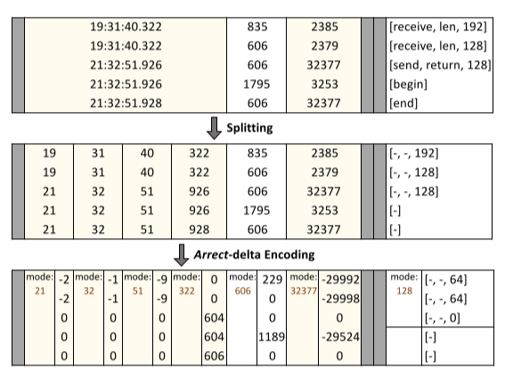
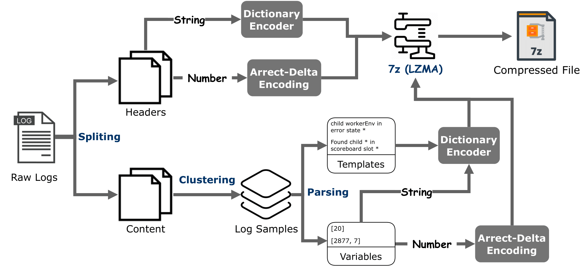
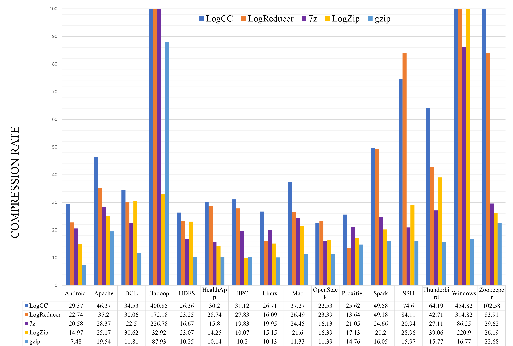
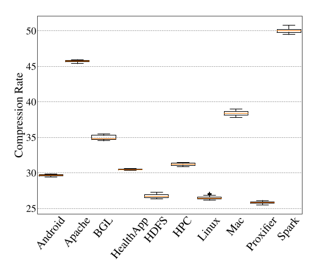
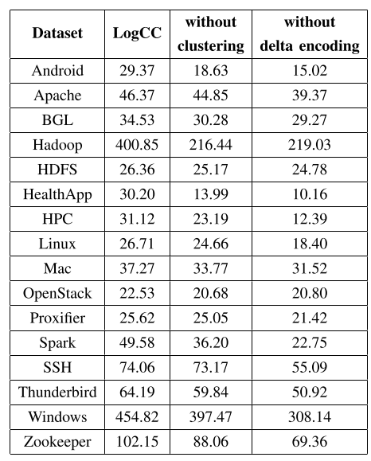
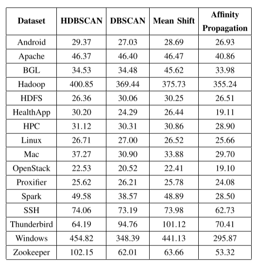

# LogCluster

Clustering Base Log Compression. 

## 1. Dependency
- python 3.9+
- py7zr
- HDBSCAN 
- sentence-transformers  

### Install:
```shell
conda env create -f environments.yaml 
```

## 2. Usage

### Download data (from LOGPAI)
```shell
./download.sh
```
### Compression
```shell
python main_compress.py -I Android.log -HL 5 -TSR "\d{2}\:\d{2}\:\d{2}\.\d{3}"  
python main_compress.py -I Apache.log -HL 6  
python main_compress.py -I BGL.log -HL 9 -TSR "\d{4}\-\d{2}\-\d{2}\-\d{2}\.\d{2}\.\d{2}\.\d{6}"  
python main_compress.py -I Hadoop.log -R 0.05 -HL 3 -TSR "\d{2}\:\d{2}\:\d{2}\,\d{3}"    
python main_compress.py -I HealthApp.log -HL 3 -SR "\|" 
python main_compress.py -I HDFS.log -HL 4  
python main_compress.py -I HPC.log -HL 2  
python main_compress.py -I Linux.log -HL 5  
python main_compress.py -I Mac.log -R 0.02 -HL 3   
python main_compress.py -I OpenStack.log -HL 5 -TSR "\d{2}\:\d{2}\:\d{2}\.\d{3}"  
python main_compress.py -I Proxifier.log -HL 3 -TSR "\d{2}\:\d{2}\:\d{2}\]"  
python main_compress.py -I Spark.log -HL 3  
python main_compress.py -I SSH.log -HL 5  
python main_compress.py -I Thunderbird.log -HL 9  
python main_compress.py -I Windows.log -HL 3  
python main_compress.py -I Zookeeper.log -R 0.07 -HL 4 -TSR "\d{2}\:\d{2}\:\d{2}\,\d{3}"  
```

For more details of parameters, please run:
```shell
python main_compress.py --help
```

Recommend applying DBSCAN if the dataset is over 100MB
#### Compression: DBSCAN (Quicker)
```shell
python main_compress.py -I Android.log -HL 5 -TSR "\d{2}\:\d{2}\:\d{2}\.\d{3}" -C  DBSCAN
```

For more details of parameters, please run:
```shell
python main_compress.py --help
```

### Decompression
Example: Assume outputs file is generated
```shell
python main_decompress.py -T outputs/Android/template -H outputs/Android/head
```

For more details of parameters, please run:
```shell
python main_decompress.py --help
```

### Lossless Check
Example: Assume output file is in output folder
```shell
pip install cdifflib
python lossless_check.py -O ./Android.log -D ./outputs/output.log
```

## 3. Arrect-Delta Encoding 
<p align="center">

</p>

In LogCluster, for example, vertically splits the timestamp, such as hours are hours, minutes are minutes, and so on. 
The results of this step are many groups of numerical values based on their positions in the log messages. 
Note that we also group numerical parameters from the same log templates to encode them. 
For example, in the above figure, we extract values from each group for hours, minutes, seconds, and milliseconds from timestamps (e.g., [19, 19, 21, 21, 21] for hours). 
Then, we find the most frequent value for each group (i.e., the mode value) and subtract all numbers in the group by their corresponding mode values.
We observe that our proposed arrect-delta encoding method obtains six times fewer patterns compared to traditional delta encoding methods.

## 4. Architecture 
<p align="center">

</p>

Given raw log messages, LogCluster separates them into headers, including timestamps and string variables, and content. LogCluster, in particular headers, uses the arrect-delta encoding method for the numerical variables, including timestamps, and applies the dictionary encoding method for the string variables. On the other hand, the content in LogCluster uses clustering methods such as HDBSCAN or DBSCAN to discover samples for parsing. Then, the dictionary encoder is used for any strings, including templates, and LogCluster applies the arrect-delta encoding method for the numerical variables, the same as the header does. In the end, LogCluster zips the data with LZMA.

## 5. Results: HDBSCAN

### Compression Rates (with HDBSCAN)
<p align="center">

</p>

LogCluster can compress all 66 GB log datasets into 1.15 GB in total, which takes only 1.76% space after compression. 
For example, on the largest dataset (i.e., Thunderbird), LogCluster can compress to 0.50 GB from the original size of 31.8 GB, which saves 98.44% of storage space. 
In terms of CR, LogCluster exceeds the most powerful log compression method (i.e., LogReducer) by achieving 1.01× (Spark) to 2.33× (Hadoop) compression rates compared to LogReducder on 14 out of 16 datasets.

**Baselines:**
[Gzip](http://www.gzip.org/), [7z (LZMA)](https://www.7-zip.org/sdk.html), [Logzip](https://arxiv.org/abs/1910.00409), [LogReducer](https://www.usenix.org/conference/fast21/presentation/wei).

**Note:**
- LogZip used the level 1 compression method

### Stability (with HDBSCAN)

| Model | Dataset    | Mean   | Variance | p-Values  |
| ------------- |------------|--------|----------|-----------|
| LogCluster | 	Android    | 29.67 | 0.01     | 3.35E-46* |
| LogReducer | Android     | 22.04  | 0.05     |   
| LogCluster | 	Apache    | 45.71  | 0.02     | 3.76E-16* |
| LogReducer | Apache     | 37.65  | 7.07     |           |
| LogCluster | 	Hadoop        | 402.55 | 23.06    | 4.23E-42* |
| LogReducer | Hadoop  | 148.12 | 94.04    |           |
| LogCluster | 	HealthApp | 30.42  | 0.003    | 2.27E-16* |
| LogReducer | HealthApp  | 28.19  | 0.56     |           |
| LogCluster | 	HPC       | 31.21  | 0.02     | 2.05E-12* |
| LogReducer | HPC        | 28.67  | 1.32     |           |
| LogCluster | 	Linux     | 26.54  | 0.06     | 1.27E-39* |
| LogReducer | Linux      | 13.31  | 0.30     |           |
| LogCluster | 	Mac       | 38.42  | 0.11     | 2.47E-30* |
| LogReducer | Mac        | 23.74  | 2.04     |           |
| LogCluster | 	OpenStack | 22.97  | 0.02     | 3.74E-17* |
| LogReducer | OpenStack  | 23.51  | 0.01     |           |
| LogCluster | 	Proxifier | 25.84  | 0.02     | 6.95E-46* |
| LogReducer | Proxifier  | 13.38  | 0.10     |           |
| LogCluster | 	SSH       | 73.67  | 0.135    | 2.11E-19* |
| LogReducer | SSH        | 88.62  | 14.79    |           |
| LogCluster | 	Zookeeper | 100.98 | 3.07     | 2.09E-20* |
| LogReducer | Zookeeper  | 79.68  | 24.16    |           |


<!--| LogCluster | 	Spark     | 65.08  | 0.113    | 2.16E-22* |
| LogReducer | Spark      | 68.29  | 0.238    |           | -->

We assume that the true average of the compression rates of datasets are no different.  
30 sample size in each sample is large enough to rely on the central limit theorem  

Null Hypothesis H0: mu1 - mu2 = 0  
Alternative Hypothesis HA: mu1- mu2 != 0  

Where mu1 = datasets' mean compression rate with LogCluster and mu2 = datasets' mean compression rate with LogRedcuer.

We reject the null hypothesis because the two-tailed p-value is smaller than the level of significance (alpha = 0.05).  
Statistically, the compression rate of LogCluster and the compression rate of LogRedcuer populations are significantly different with datasets.
<p align="center">

</p>

### Ablation Study
<p align="center">

</p>
LogCluster achieves the best performance using both clustering and delta encoding. When these two parts are missing, the performance of the model drops significantly, especially when the arrect-delta encoder is missing. 
For example, on the Zookeeper dataset, the compression rate decreases by 13.79% and 32.09% when clustering and delta encoding are removed, respectively. 
Thus, the results demonstrate the usefulness of the proposed clustering-based sampling algorithm and
the arrect-delta encoding module of LogCluster.

### Different Settings

#### Different Clustering
<p align="center">

</p>
LogCluster can achieve relatively high results with different clustering methods. For example, the compression rates achieved by DBSCAN and Mean Shift are comparable with HDBSCAN on some datasets. It indicates that these clustering methods can select optimized sets of log messages for log parsing. Still, LogCluster performs
the best with HDBSCAN on almost all datasets.

[DBSCAN](https://scikit-learn.org/stable/modules/generated/sklearn.cluster.DBSCAN.html), [Mean Shift](https://www.geeksforgeeks.org/ml-mean-shift-clustering/), [Affinity Propagation](https://en.wikipedia.org/wiki/Affinity_propagation)

### Lossless (HDBSCAN)

| Dataset       | LogCluster     | LogReducer    |
|---------------|-----------|---------------|
| Android       | 98.28 %   | 99.58 %       |
| Apache        | 100 %     | 99.88 %       |
| BGL           | 97.34 %   | 100 %         |
| Hadoop        | 95.9 %    | 99.26 %       |
| HealthApp     | 98.11 %   | 99.95 %       |
| HDFS          | 99.27 %   | 99.98 %       |
| HPC           | 100 %     | 100 %         |
| Linux         | 100 %     | 99.7 %        |
| Mac           | 98.54 %   | 99.09 %       | 
| OpenStack     | 99.51 %   | 100 %         | 
| Proxifier     | 100 %     | 99.81 %       | 
| Spark         | 100 %     | 100 %         | 
| SSH           | 100 %     | 99.77 %       | 
| Zookeeper     | 100 %     | 99.95 %       | 
| ------------- | --------- | ------------- |
| Mean          | 99.06%    | 99.78%           |

We measured lossless for each compressed dataset by LogCluster (HDBSCAN).  
If the decompressed line did not match the original sentence, we calculated the ratio with SequenceMatcher.  
Otherwise, the ratio is 1. Then, we divided the sum of the ratio by the total number of original lines.  
LogCluster guarantees to provide high lossless when the datasets are well-organized, such as SSH. On the other hand, if the datasets contain an empty line or tab space, such as Hadoop, LogCluster drops the lossless rate.
